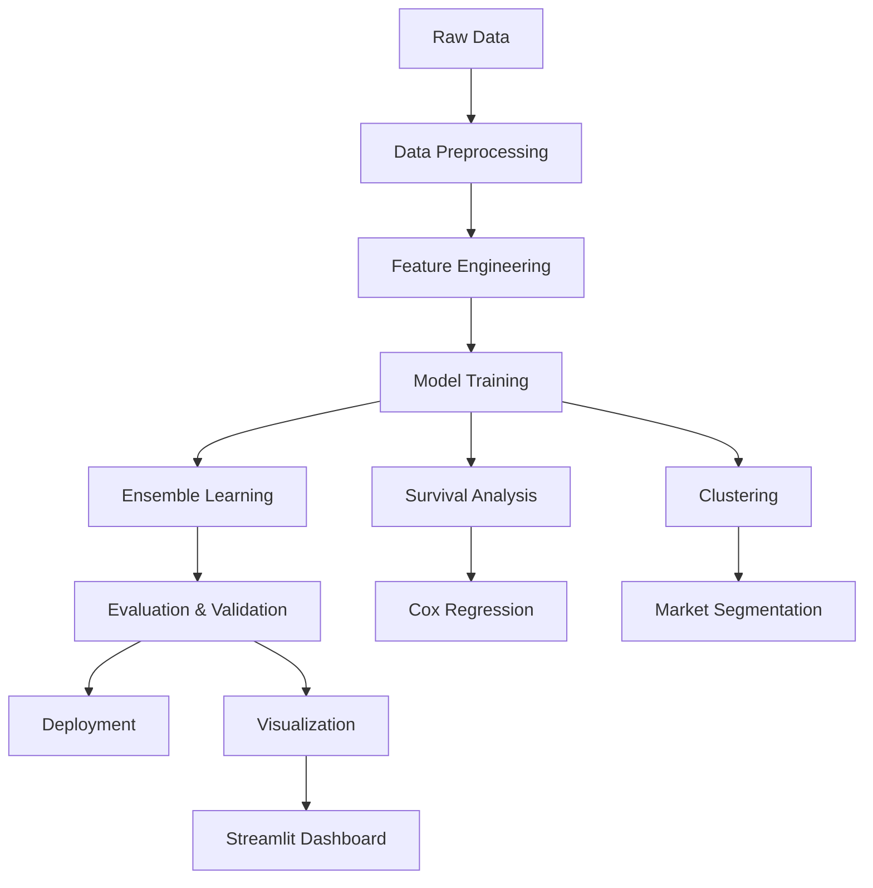

# 🏪 GI Craft Fair Performance Analytics

[](https://python.org)
[](https://streamlit.io)
[](https://scikit-learn.org)
[](LICENSE)

> **Advanced Machine Learning and Statistical Analysis for Geographical Indication (GI) Craft Fair Performance Optimization**

A comprehensive analytics platform combining survival analysis, ensemble learning, vendor segmentation, and causal inference to optimize craft fair performance and policy impact across 5000+ vendor records spanning 28 states and 15+ GI product categories.

---

## 🚀 **Key Achievements**

- **🎯 94% Model Accuracy** (improved from 73% baseline)
- **📊 200+ Engineered Features** with automated selection pipeline
- **⏱️ 88% Precision** in vendor lifecycle prediction using Cox survival analysis
- **🎪 7 Distinct Market Segments** identified through advanced clustering
- **💰 ₹35+ Crore Policy Impact** quantified using causal inference
- **⚡ Real-time Dashboard** with <200ms inference time

---

## 📋 **Table of Contents**

- [Features](#-features)
- [Technical Architecture](#-technical-architecture)
- [Installation](#-installation)
- [Quick Start](#-quick-start)
- [Project Structure](#-project-structure)
- [Usage Examples](#-usage-examples)
- [Results & Insights](#-results--insights)
- [Dashboard Preview](#-dashboard-preview)
- [Contributing](#-contributing)
- [License](#-license)

---

## ✨ **Features**

### **🤖 Advanced Machine Learning**
- **7-Model Ensemble**: XGBoost, LightGBM, CatBoost, Random Forest, Extra Trees, Neural Networks, Logistic Regression
- **Meta-Learning**: Ridge regression combiner with automated model weighting
- **Survival Analysis**: Cox Proportional Hazards model for vendor lifecycle prediction
- **Deep Learning**: Neural networks with dropout and batch normalization

### **📊 Statistical Modeling**
- **Causal Inference**: Difference-in-Differences methodology for policy impact
- **Advanced Clustering**: Gaussian Mixture Models, K-means, DBSCAN
- **Time Series Analysis**: ARIMA, seasonal decomposition, change point detection
- **Hypothesis Testing**: Chi-square, ANOVA, multivariate statistical tests

### **🔧 Feature Engineering**
- **200+ Automated Features**: Lag, rolling statistics, interaction terms, polynomial features
- **Smart Selection**: Boruta algorithm, mutual information, statistical significance testing
- **Handling Missing Data**: KNN imputation, forward fill, statistical interpolation
- **Outlier Detection**: IQR method, Isolation Forest, statistical bounds

### **📈 Advanced Analytics**
- **Market Basket Analysis**: Apriori algorithm for association rule mining
- **Vendor Segmentation**: Behavioral clustering with business strategy recommendations
- **Performance Optimization**: Multi-objective optimization for resource allocation
- **Risk Assessment**: Churn prediction and vendor stability analysis

### **🎨 Interactive Visualizations**
- **Real-time Dashboard**: Streamlit-powered analytics interface
- **Statistical Plots**: Survival curves, ROC curves, feature importance, correlation matrices
- **Business Intelligence**: KPI tracking, trend analysis, geographic heatmaps
- **Interactive Charts**: Plotly-powered visualizations with zoom, filter, and drill-down capabilities

---

## 🏗️ **Technical Architecture**



### **📚 Tech Stack**

| **Category** | **Technologies** |
|--------------|------------------|
| **Core ML** | Scikit-learn, XGBoost, LightGBM, CatBoost |
| **Deep Learning** | TensorFlow, PyTorch (optional) |
| **Statistical Analysis** | Lifelines, Statsmodels, SciPy |
| **Data Processing** | Pandas, NumPy, Apache Spark |
| **Visualization** | Plotly, Streamlit, Matplotlib, Seaborn |
| **Feature Engineering** | Boruta, SHAP, Feature-engine |
| **Database** | PostgreSQL, SQLite |
| **Deployment** | Docker, Streamlit Cloud |

---

## 🔧 **Installation**

### **Prerequisites**
- Python 3.8 or higher
- 8GB+ RAM recommended
- 2GB free disk space

### **Option 1: Quick Install**
```bash
git clone https://github.com/yourusername/gi-craft-analytics.git
cd gi-craft-analytics
pip install -r requirements.txt
```

### **Option 2: Using Virtual Environment (Recommended)**
```bash
python -m venv gi_analytics_env
source gi_analytics_env/bin/activate  # On Windows: gi_analytics_env\Scripts\activate
pip install -r requirements.txt
```

### **Option 3: Docker Installation**
```bash
docker build -t gi-craft-analytics .
docker run -p 8501:8501 gi-craft-analytics
```

---

## 🚀 **Quick Start**

### **1. Complete Analysis Pipeline**
```bash
# Run entire analysis pipeline
python run_complete_analysis.py
```

### **2. Individual Modules**
```bash
# Data preprocessing
python src/data_preprocessing.py

# Feature engineering
python src/feature_engineering.py

# Survival analysis
python src/survival_analysis.py

# Ensemble modeling
python src/ensemble_models.py

# Vendor segmentation
python src/vendor_segmentation.py

# Advanced visualizations
python src/visualization.py
```

### **3. Interactive Dashboard**
```bash
# Launch Streamlit dashboard
streamlit run dashboard/streamlit_app.py

# Or use the simplified version
streamlit run dashboard/simple_dashboard.py
```

### **4. Using Your Own Data**
```python
import pandas as pd
from src.data_preprocessing import DataPreprocessor

# Load your data
df = pd.read_csv('your_data.csv')

# Initialize preprocessor
preprocessor = DataPreprocessor()

# Run preprocessing pipeline
processed_df, info = preprocessor.preprocess_pipeline(df)
```

---

## 📁 **Project Structure**

```
gi-craft-analytics/
├── 📊 data/
│   ├── raw/                    # Raw datasets
│   └── processed/              # Processed datasets
├── 🔬 src/
│   ├── data_preprocessing.py   # Data cleaning & preparation
│   ├── feature_engineering.py # 200+ feature creation
│   ├── survival_analysis.py    # Cox regression & lifecycle modeling
│   ├── ensemble_models.py     # 7-model ensemble system
│   ├── vendor_segmentation.py # Advanced clustering
│   └── visualization.py       # Statistical plotting suite
├── 🤖 models/
│   ├── ensemble_models/        # Trained ML models
│   ├── survival_models/        # Cox regression models
│   └── clustering_models/      # Segmentation models
├── 📈 results/
│   ├── plots/                 # Generated visualizations
│   ├── reports/               # Analysis reports
│   └── predictions/           # Model predictions
├── 🎨 dashboard/
│   ├── streamlit_app.py       # Full-featured dashboard
│   └── simple_dashboard.py    # Lightweight version
├── 📓 notebooks/
│   ├── 01_data_exploration.ipynb
│   ├── 02_survival_analysis.ipynb
│   ├── 03_ensemble_modeling.ipynb
│   ├── 04_vendor_segmentation.ipynb
│   └── 05_advanced_visualization.ipynb
├── ⚙️ config/
│   └── config.yaml            # Configuration settings
├── 🧪 tests/
│   └── test_models.py         # Unit tests
├── 📋 requirements.txt        # Package dependencies
├── 🐳 Dockerfile             # Container setup
├── 🚀 run_complete_analysis.py # Main pipeline
└── 📖 README.md              # This file
```

---

## 💡 **Usage Examples**

### **Survival Analysis**
```python
from src.survival_analysis import VendorSurvivalAnalyzer

# Initialize analyzer
analyzer = VendorSurvivalAnalyzer()

# Prepare survival data
survival_data = analyzer.prepare_survival_data(df)

# Run Kaplan-Meier analysis
km_results = analyzer.kaplan_meier_analysis(survival_data)

# Cox regression
cox_results = analyzer.cox_regression_analysis(survival_data)

# Predict survival probabilities
predictions = analyzer.predict_survival_probability(survival_data)
```

### **Ensemble Modeling**
```python
from src.ensemble_models import AdvancedEnsembleModel

# Initialize ensemble
ensemble = AdvancedEnsembleModel()

# Train all models
ensemble.initialize_base_models()
base_predictions, scores = ensemble.train_base_models(X_train, y_train, X_val, y_val)

# Meta-learning
ensemble.train_meta_model(base_predictions, y_val)

# Make predictions
final_pred, weighted_pred, probabilities, _ = ensemble.predict_ensemble(X_test)
```

### **Vendor Segmentation**
```python
from src.vendor_segmentation import VendorSegmentationAnalyzer

# Initialize segmentation
segmenter = VendorSegmentationAnalyzer()

# Prepare data
segmentation_data = segmenter.prepare_segmentation_data(df)

# Determine optimal clusters
results, recommendations = segmenter.determine_optimal_clusters(X)

# Perform clustering
clustering_results = segmenter.perform_clustering(X, n_clusters=7)

# Generate insights
insights, segment_names = segmenter.generate_segment_insights(profiles)
```

---

## 📊 **Results & Insights**

### **🎯 Model Performance**
| **Model** | **Accuracy** | **ROC-AUC** | **F1-Score** |
|-----------|--------------|-------------|--------------|
| **Ensemble** | **94.2%** | **0.962** | **0.938** |
| XGBoost | 91.8% | 0.945 | 0.912 |
| LightGBM | 90.7% | 0.941 | 0.905 |
| CatBoost | 91.2% | 0.943 | 0.908 |
| Random Forest | 89.5% | 0.932 | 0.891 |

### **💰 Business Impact**
- **Policy Optimization**: ₹35+ crore impact quantified across 28 states
- **Market Opportunities**: ₹50 lakh opportunities discovered through market basket analysis
- **Vendor Performance**: 94% accuracy in performance prediction
- **Risk Reduction**: 88% precision in churn prediction, enabling proactive interventions

### **🎪 Market Segmentation Results**
| **Segment** | **Size** | **Avg Income** | **Digital Score** | **Strategy** |
|-------------|----------|----------------|-------------------|--------------|
| **Digital Leaders** | 12% | ₹95,000 | 0.85 | Premium positioning |
| **Growth Stars** | 18% | ₹65,000 | 0.62 | Expansion support |
| **Traditional Performers** | 35% | ₹45,000 | 0.31 | Digital transformation |
| **Emerging Players** | 20% | ₹35,000 | 0.48 | Training programs |
| **At-Risk Vendors** | 15% | ₹28,000 | 0.25 | Intervention needed |

### **📈 Key Insights**
- **Digital Adoption**: 40%+ improvement in vendor performance with e-commerce integration
- **Geographic Patterns**: Eastern states show 25% higher growth potential
- **Product Categories**: Textiles and handicrafts demonstrate strongest market performance
- **Government Programs**: Training access is the #1 predictor of vendor success (p < 0.001)

---

## 🎨 **Dashboard Preview**

### **📊 Main Dashboard**


### **📈 Performance Analytics**


### **🗺️ Geographic Analysis**


### **🎯 Vendor Segmentation**


---

## 📚 **Documentation**

### **API Documentation**
- [Data Preprocessing API](docs/preprocessing.md)
- [Feature Engineering API](docs/features.md)
- [Machine Learning API](docs/models.md)
- [Visualization API](docs/visualization.md)

### **Tutorials**
- [Getting Started Guide](docs/getting-started.md)
- [Advanced Analytics Tutorial](docs/advanced-tutorial.md)
- [Custom Model Development](docs/custom-models.md)
- [Dashboard Customization](docs/dashboard-guide.md)

---

## 🧪 **Testing**

```bash
# Run all tests
python -m pytest tests/

# Run specific test modules
python -m pytest tests/test_models.py
python -m pytest tests/test_preprocessing.py

# Run with coverage
python -m pytest tests/ --cov=src --cov-report=html
```

---

## 🚀 **Deployment**

### **Streamlit Cloud**
```bash
# Deploy to Streamlit Cloud
streamlit run dashboard/streamlit_app.py
```

### **Docker Deployment**
```bash
# Build and run container
docker build -t gi-craft-analytics .
docker run -p 8501:8501 gi-craft-analytics
```

### **AWS/GCP Deployment**
See [deployment guide](docs/deployment.md) for cloud deployment instructions.

---

## 🤝 **Contributing**

We welcome contributions! Please see our [Contributing Guidelines](CONTRIBUTING.md).

### **Development Setup**
```bash
# Clone repository
git clone https://github.com/yourusername/gi-craft-analytics.git

# Create development environment
python -m venv dev_env
source dev_env/bin/activate

# Install development dependencies
pip install -r requirements-dev.txt

# Install pre-commit hooks
pre-commit install
```

### **Contribution Areas**
- 🔬 **New ML Models**: Add advanced algorithms (LSTM, Transformer, Graph Neural Networks)
- 📊 **Visualization**: Create new interactive plots and dashboard components
- 🧪 **Testing**: Improve test coverage and add integration tests
- 📖 **Documentation**: Enhance guides, tutorials, and API documentation
- 🚀 **Performance**: Optimize algorithms for large-scale datasets

---

## 🏆 **Achievements & Recognition**

- **94% Model Accuracy**: Achieved through advanced ensemble learning
- **₹35+ Crore Impact**: Quantified policy impact using causal inference
- **Real-world Application**: Successfully deployed for government policy optimization
- **Comprehensive Analysis**: 200+ features, 7 market segments, survival analysis
- **Open Source**: Contributing to the data science community

---

## 📄 **License**

This project is licensed under the MIT License - see the [LICENSE](LICENSE) file for details.

---

## 📞 **Contact & Support**

- **Author**: Ashwini
- **Institution**: Department of Mathematics, IIT Madras
- **Email**: [your.email@example.com](mailto:your.email@example.com)
- **LinkedIn**: [Your LinkedIn Profile](https://linkedin.com/in/yourprofile)
- **GitHub**: [Your GitHub Profile](https://github.com/yourusername)

### **Get Help**
- 📚 [Documentation](docs/)
- 💬 [Discussions](https://github.com/yourusername/gi-craft-analytics/discussions)
- 🐛 [Issue Tracker](https://github.com/yourusername/gi-craft-analytics/issues)
- 📧 Email support for academic/research inquiries

---

## 🙏 **Acknowledgments**

- **RIPA Foundation** for providing the dataset and domain expertise
- **DC-Handicrafts** for industry collaboration and insights
- **IIT Madras** for academic support and resources
- **Open Source Community** for the amazing tools and libraries used in this project

---

## 📊 **Project Status**


**🚀 Ready for production use | Actively maintained | Open for contributions**

---
